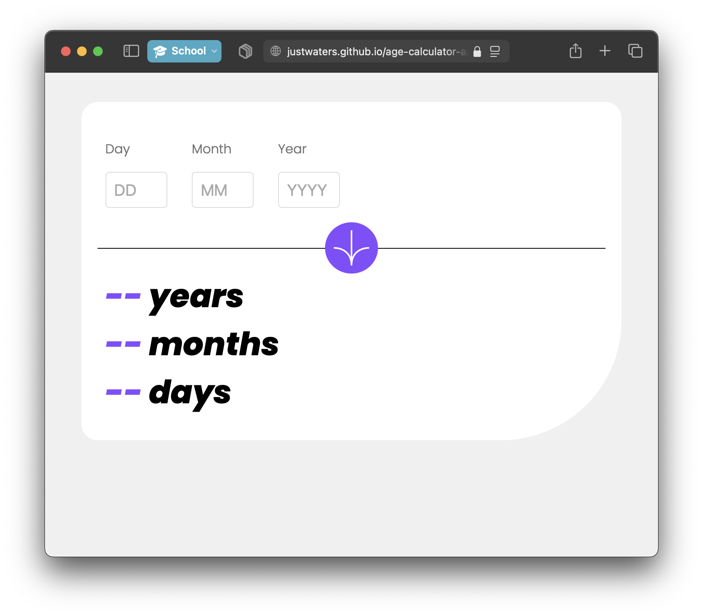

# Frontend Mentor - Age calculator app solution

This is a solution to the [Age calculator app challenge on Frontend Mentor](https://www.frontendmentor.io/challenges/age-calculator-app-dF9DFFpj-Q). Frontend Mentor challenges help you improve your coding skills by building realistic projects.

## Table of contents

- [Screenshot](#screenshot)
- [Links](#links)
- [Code highlight](#some-code-im-proud-of)
- [Useful resources](#resources)
- [Author](#author)

## Screenshot



## Links

- Solution URL: [https://github.com/justwaters/age-calculator-app](https://github.com/justwaters/age-calculator-app)
- Live Site URL: [https://justwaters.github.io/age-calculator-app/](https://justwaters.github.io/age-calculator-app/)

## Some code I'm proud of

```css
input::-webkit-outer-spin-button,
input::-webkit-inner-spin-button {
	-webkit-appearance: none;
	margin: 0;
}
```

```js
function testInt(data) {
	result = Number(data);
	console.log(typeof result + " / " + result);
	if (isNaN(result)) {
		console.log("Check testInt failed!");
		return 0;
	} else {
		console.log("Check testInt passed!");
		return result;
	}
}
```

## Resources

- [MDN Docs](https://developer.mozilla.org/en-US/)
- [W3Schools](https://www.w3schools.com/)
- [CSS Tricks](https://css-tricks.com/)
- [Stack Overflow](https://stackoverflow.com/)

## Author

- Website - [JD Waters](justin.1waters.com)
- GitHub - [@justwaters](https://www.github.com/justwaters)
